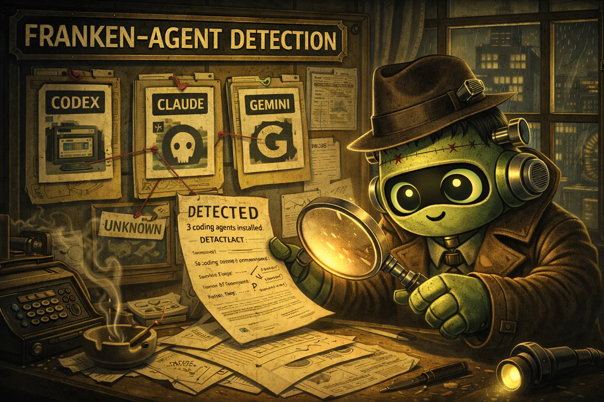

# franken-agent-detection

<div align="center">
  
</div>

<div align="center">

[](https://crates.io/crates/franken-agent-detection)
[](https://docs.rs/franken-agent-detection)
[](LICENSE)

</div>

A small Rust crate for deterministic, local detection of installed coding-agent tools.

```bash
cargo add franken-agent-detection
```

## What this crate does

Many tools need to answer a simple question: which coding-agent connectors are available on this machine? This crate gives you one consistent report shape, one probe flow, and test-friendly root overrides.

| Capability | `franken-agent-detection` |
|---|---|
| Stable JSON-serializable report | Yes |
| Explicit connector scoping | Yes (`only_connectors`) |
| Deterministic fixture mode | Yes (`root_overrides`) |
| Async runtime required | No |
| Tokio dependency | No |

## Example

```rust
use franken_agent_detection::{
    detect_installed_agents, AgentDetectOptions, AgentDetectRootOverride,
};
use std::path::PathBuf;

fn main() -> Result<(), Box<dyn std::error::Error>> {
    let report = detect_installed_agents(&AgentDetectOptions {
        only_connectors: Some(vec!["codex".into(), "gemini".into()]),
        include_undetected: true,
        root_overrides: vec![
            AgentDetectRootOverride {
                slug: "codex".into(),
                root: PathBuf::from("/tmp/mock-codex"),
            },
            AgentDetectRootOverride {
                slug: "gemini".into(),
                root: PathBuf::from("/tmp/mock-gemini"),
            },
        ],
    })?;

    println!(
        "Detected {} of {}",
        report.summary.detected_count, report.summary.total_count
    );
    Ok(())
}
```

## Design goals

1. Keep output stable for downstream tooling and snapshot tests.
2. Keep behavior explicit, including connector normalization and unknown connector errors.
3. Keep detection local to filesystem probes, with no network dependency.
4. Stay runtime-neutral with a synchronous API.

## Comparison

| Approach | Pros | Cons |
|---|---|---|
| `franken-agent-detection` | Shared schema, test overrides, consistent connector handling | Focused scope (detection only) |
| Ad-hoc per-project checks | Fast to start | Drift, inconsistent outputs, repeated bugs |
| Full search/index systems | Rich capabilities | Unnecessary weight for install detection |

## Installation

### crates.io (recommended)

```bash
cargo add franken-agent-detection
```

### Cargo.toml

```toml
[dependencies]
franken-agent-detection = "0.1.3"
```

### From source

```bash
git clone https://github.com/Dicklesworthstone/franken_agent_detection
cd franken_agent_detection
cargo test
```

## Quick start

1. Add the dependency from crates.io.
2. Call `detect_installed_agents(&AgentDetectOptions::default())`.
3. Read `report.installed_agents` and `report.summary`.
4. Use `only_connectors` when you want to scope checks.
5. Use `root_overrides` for deterministic tests.

## API reference

| Item | Purpose |
|---|---|
| `AgentDetectOptions` | Control connector filtering and override roots |
| `AgentDetectRootOverride` | Per-connector custom probe root |
| `detect_installed_agents` | Run probes and produce full report |
| `InstalledAgentDetectionReport` | Top-level report payload |
| `AgentDetectError` | `UnknownConnectors` and feature-related errors |

## Configuration

The crate is configured through function inputs, not environment variables:

```rust
AgentDetectOptions {
    only_connectors: Some(vec!["codex".into(), "claude".into()]),
    include_undetected: false,
    root_overrides: vec![],
}
```

## How detection works

```text
detect_installed_agents(opts)
        |
        +--> normalize connector slugs
        +--> validate known connectors
        +--> build probe roots (default + overrides)
        +--> filesystem existence checks
        +--> stable InstalledAgentDetectionReport
```

## Troubleshooting

| Symptom | Cause | Fix |
|---|---|---|
| `UnknownConnectors` error | Connector slug not recognized | Use known slugs (`codex`, `claude`, `gemini`, etc.) |
| Empty results | No roots exist on this machine | Set `include_undetected = true` to inspect evidence |
| Non-deterministic tests | Real home-dir probing in tests | Use `root_overrides` with temp directories |
| Missing connector in report | Scoped connectors exclude it | Remove or expand `only_connectors` |
| Docs mismatch | Local version differs from docs.rs | Align crate version with docs URL |

## Limitations

- Installation detection only; no session parsing or indexing.
- Default probe roots are opinionated and can require overrides in custom environments.
- No background watching; checks run only when called.

## FAQ

### Does this crate require tokio or any async runtime?
No. It is synchronous and runtime-neutral.

### Is network access required?
No. Detection is local filesystem probing only.

### Can I test this deterministically in CI?
Yes. Use `root_overrides` with temporary fixture directories.

### How stable is the report schema?
The report is meant for machine consumption and versioned with `format_version`.

### Can this detect every possible agent tool?
It detects a curated connector set and aliases. Unknown connectors return explicit errors.

## About Contributions

> *About Contributions:* Please don't take this the wrong way, but I do not accept outside contributions for any of my projects. I simply don't have the mental bandwidth to review anything, and it's my name on the thing, so I'm responsible for any problems it causes; thus, the risk-reward is highly asymmetric from my perspective. I'd also have to worry about other "stakeholders," which seems unwise for tools I mostly make for myself for free. Feel free to submit issues, and even PRs if you want to illustrate a proposed fix, but know I won't merge them directly. Instead, I'll have Claude or Codex review submissions via `gh` and independently decide whether and how to address them. Bug reports in particular are welcome. Sorry if this offends, but I want to avoid wasted time and hurt feelings. I understand this isn't in sync with the prevailing open-source ethos that seeks community contributions, but it's the only way I can move at this velocity and keep my sanity.

## License

MIT
